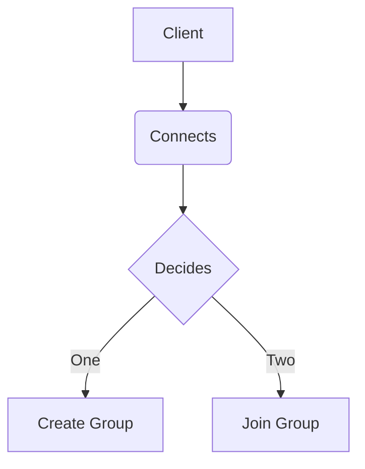

<kbd>
  
</kbd>

# ✨ Simple TCP/IP chatroom written in Java swing 
Questo progetto implementa una semplice chatroom in Java,
composta da un server e un'interfaccia grafica per il client, il quale
potrà creare un nuovo gruppo, oppure unirsi a uno già esistente.

## 📑 Dipendenze
**Java Development Kit (JDK) 8 o versioni successive**

## 🖥️ Server
Il server è responsabile della gestione delle connessioni dei client
e della comunicazione all'interno dei gruppi.

## ⏯️ Utilizzo
Compilare il codice sorgente del server in maniera tale da permettere la connessione dei client.

``` Java
javac Server.java
```

🏃 Avviare il server.

``` Java
java Server [numeroPorta]
```
> [!tip]
> Il server si metterà in ascolto ad esempio, sulla porta 5555 per le connessioni dei client.

## ⚙️ Funzionalità

1. Creazione di nuovi gruppi e unione a gruppi esistenti.
2. Comunicazione all'interno dei gruppi.
3. Cambio del nickname degli utenti.
4. Informazioni riguardanti i componenti del gruppo.
5. Chiusura e gestione delle connessioni.

## 💻  Client
Il client fornisce un'interfaccia grafica per interagire con il server, partecipare alle chat e interagirci.

## ⏯️ Utilizzo
Compilare il codice sorgente del client.

``` Java
javac Client.java
```

🏃Avviare l'applicazione client.

``` Java
java Client
```
Eseguire la propria scelta e successivamente inserire un username per entrare dentro a un gruppo.



## ⚙️ Funzionalità

1. Connessione al server tramite socket TCP.
2. Invio e ricezione di messaggi testuali.
3. Creazione e unione a gruppi.
4. Visualizzazione dei gruppi attivi.
5. Cambio del nickname degli utenti.
6. Visualizzazione utenti nel gruppo.
7. Visualizzazione immagini di gatti casuali, presi tramite API.
8. Uscita dalla chat.


> [!IMPORTANT]
> ## Estensioni future
> - Implementare funzionalità di autenticazione degli utenti.
> - Aggiungere supporto per allegati e messaggi multimediali.
> - Migliorare l'interfaccia utente per una gestione più intuitiva dei gruppi.
> - Aggiungere funzionalità di crittografia per la sicurezza delle comunicazioni. 

